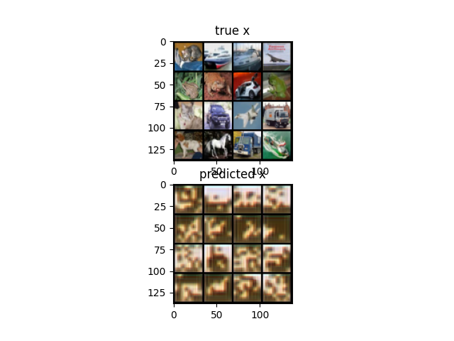
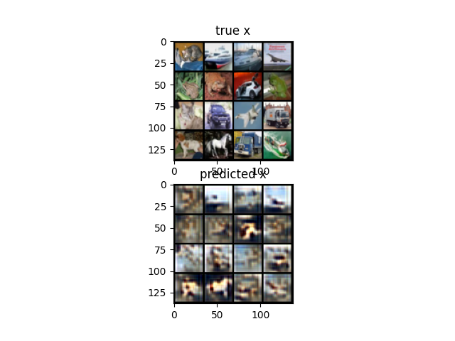
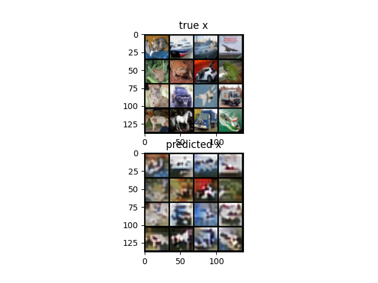
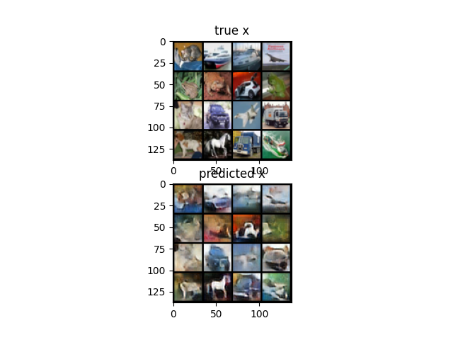
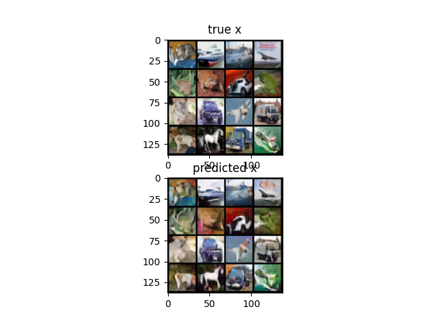
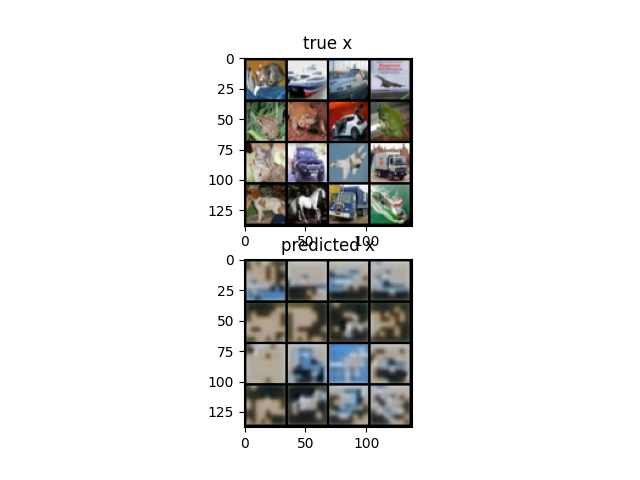
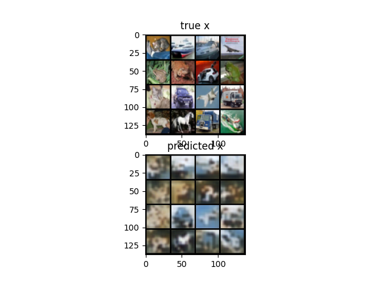
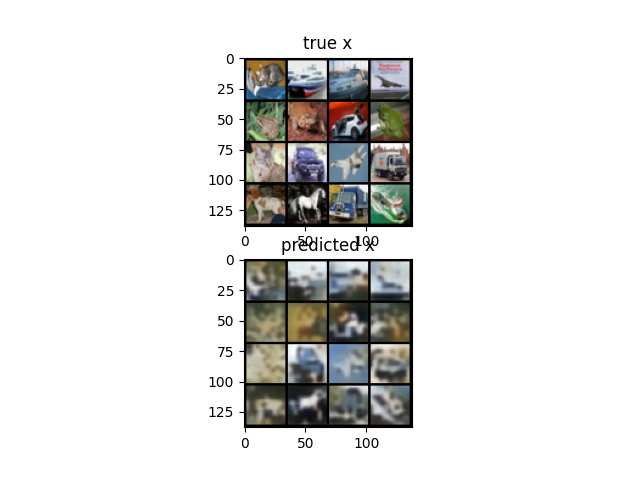
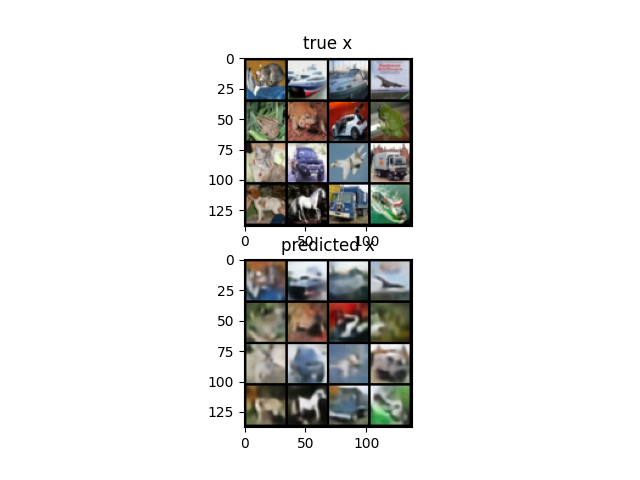
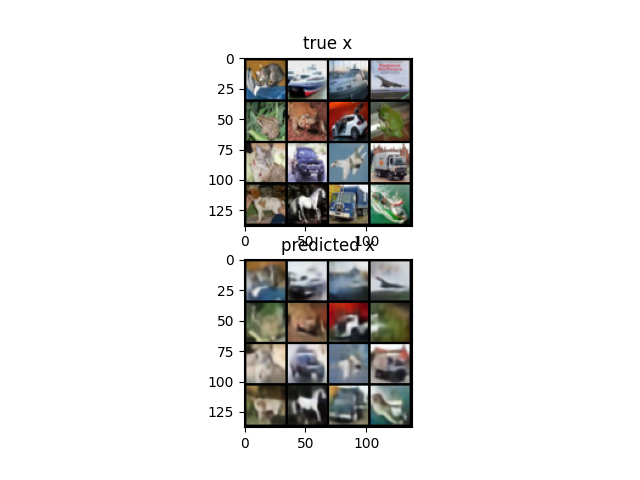

# vqgan
Pytorch implementation of VQGAN and comparison with VQVAE.

## Development
I encountered some bugs during code development. 
More details can be found [here](debug.md).
I think some debugging process is insightful, so please take a look at it.

## Installation
```bash
pip install -r ./requirements.txt
```

## Train
```bash
python train.py
```
Log can be found in `./log` directory.
Please keep an eye on balance between min and max loss as the balance is the important aspect of successful GAN training.
Also, I experienced _dying relu_ effect.
Thus, I changed `relu` to `gelu` in discriminator.

## Result
Interestingly, training time for decent quality image for VQGAN takes longer than VQVAE. 
I posit this comes from the difficulty of training GAN; you need learned discriminator to train generator. 
However, generated images from VQGAN was more crsip and detailed than VQVAE whose result was more smooth.
Below is the comparison of VQGAN and VQVAE.

### VQGAN
500 Iteration



1000 Iteration



1500 Iteration



10000 Iteration



20000 Iteration



### VQVAE
500 Iteration



1000 Iteration



1500 Iteration



10000 Iteration



20000 Iteration


