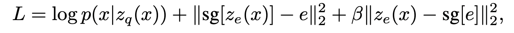

# Debug note

This is a note about bugs encountered while developping the model.
I will describe bugs in each section in more detail.
Also, I will write notes on techniques that are note-worthy.

## Stop gradient
### 1. With torch.autograd.Function
``` python
class VectorQuantization(torch.autograd.Function):

    @staticmethod
    def forward(ctx, z, codebook):
        z_sq = torch.sum(z**2, dim=1, keepdim=True)
        codebook_sq = torch.sum(codebook**2, dim=1)
        sq = z_sq + codebook_sq

        norm = torch.addmm(sq, z, codebook.T, beta=1, alpha=-2)
        indices = norm.argmin(dim=1)

        z_q = codebook.index_select(0, indices)

        ctx.save_for_backward(codebook, indices)
        ctx.mark_non_differentiable(indices)
        return z_q
    
    @staticmethod
    def backward(ctx, z_q_grad):
        codebook, indices = ctx.saved_tensors
        z_grad, codebook_grad = None, None

        if ctx.needs_input_grad[0]:
            z_grad = z_q_grad
        
        if ctx.needs_input_grad[1]:
            codebook_grad = torch.zeros_like(codebook)
            codebook_grad[indices] = z_q_grad
        
        return z_grad, codebook_grad
```
This method defines the forward and backward function of stop gradient. 
Note there are two components as input: `z`, `codebook`, and one component as output: `z_q`.
Backward function computes the gradient flow for each input component.
Here, gradient flow for `z` is an identity function.
  
### 2. Detach offset
I find this method quite clever, but won't be applied to more general cases.
Below is a modified version of other's implementation (need to add reference).
Note that by detaching the offset of quantized `z_q`, gradient of `z` can be passed through.
Note that there is no gradient flow to codebook with this method.
```python
class VectorQuantizer(nn.Module):
    def __init__(self):
        super(VectorQuantizer, self).__init__()
        
        self._embedding = nn.Parameter(torch.rand(512, 256))

    def forward(self, inputs):
        
        # Calculate distances
        distances = (torch.sum(inputs**2, dim=1, keepdim=True) 
                    + torch.sum(self._embedding**2, dim=1)
                    - 2 * torch.matmul(inputs, self._embedding.T))
            
        # Encoding
        encoding_indices = torch.argmin(distances, dim=1)
        z_q = self._embedding.index_select(0, encoding_indices)
        
        
        # Loss
        rec_z_q = inputs + (z_q - inputs).detach()
        
        # convert quantized from BHWC -> BCHW
        return rec_z_q, z_q
```

## Computation graph
This bug was very difficult to notice.
What I observed is exploding loss function, so I split the loss into reconstruction loss and the rest (vq loss and commitment loss).
It was vq loss and commitment loss that were exploding.

To debug, I compared my code with answer code and revisited vqvae paper.
Then, I noticed I was **passing gradient to encoder more than needed to!**
``` python
        # gradient flows to z when computing vq_loss and commitment_loss
        e = self.vq(z, self.codebook)
```
VQ loss is the second term in the equation below.
With the implementation above, gradient will flow to encoder as well.
It is because _e_ gets _z_ and _codebook_ as input, and gradient for _z_ is copied via straight through techniuqe.
This is very subtle, so draw computational graph to understand.


Below is the remedy; split the gradient flow properly, one for reconstrucction loss and the other for vq/commitment loss.

``` python
        # will be used for vq_loss and commitment_loss
        e = self.vq(z.detach(), self.codebook)

        # will be used for reconstruction_loss
        z_q = self.vq(z, self.codebook.detach())
        z_q = rearrange(z_q, "(b h w) c -> b c h w", b=b, h=h, w=w, c=c)
```

